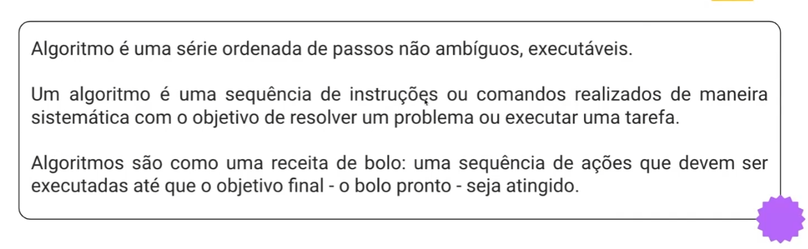
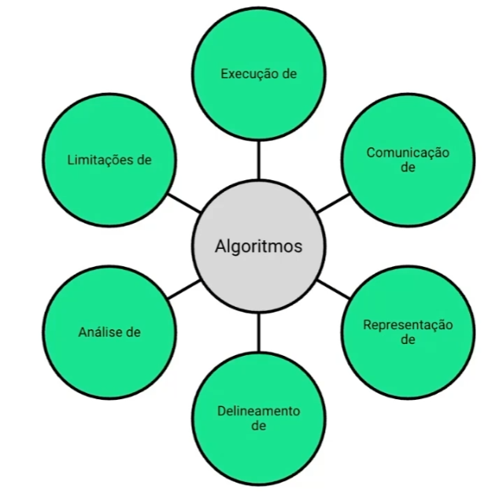
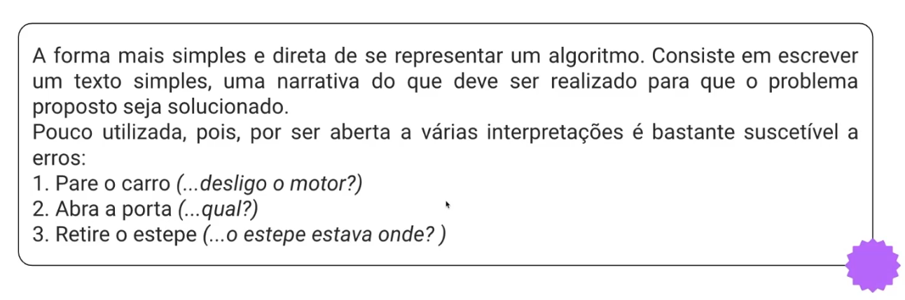
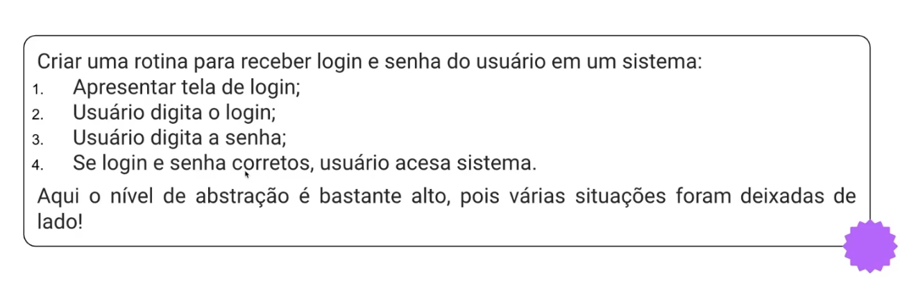
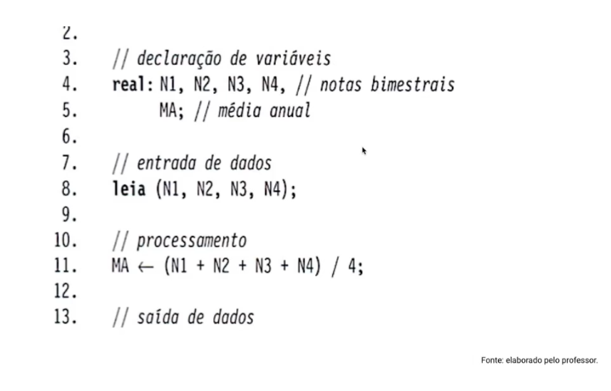

 # Algorítimo

O que é ?
 1. Entradas
 2. Processamento
 3. Saída

### O que se estuda em algorítimo ?

### Como Representar algorítimos ?

**Narração Descritiva**

**Exemplo:**

**Fluxograma:**

**Psdeudocódigo:**

