 
# Linguagens de programação

**Para que serve?**

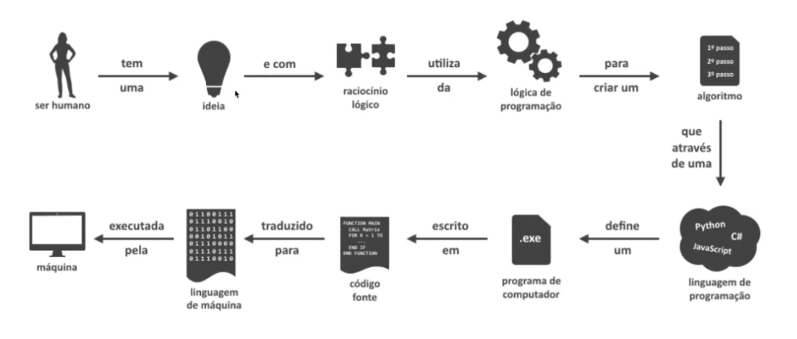

Exemplos de linguagens

- Cobol
- C
- C++
- C#
- Php
- Python
- Java
- Assembly
- JavaScript
- Ruby
- Swift

## Linguagens de baixo e alto nível

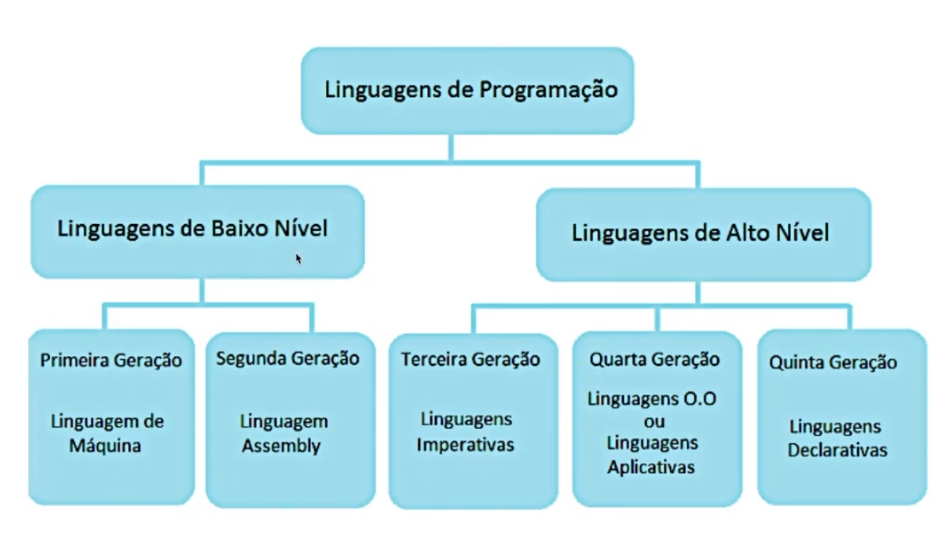

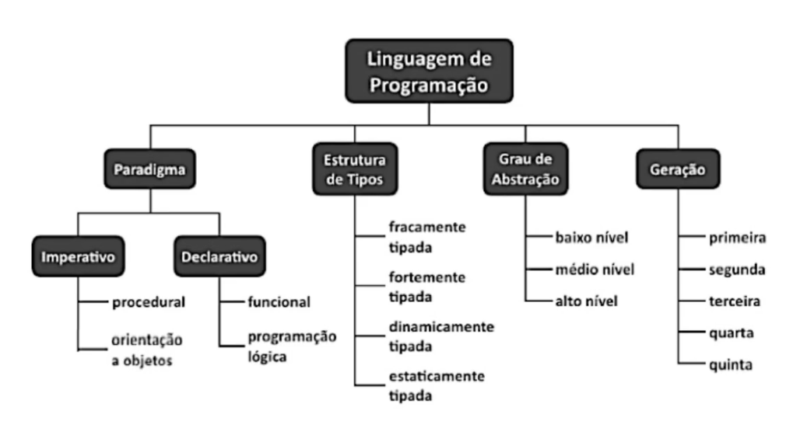

## Paradigmas
### Paradigma Imperativo procedural

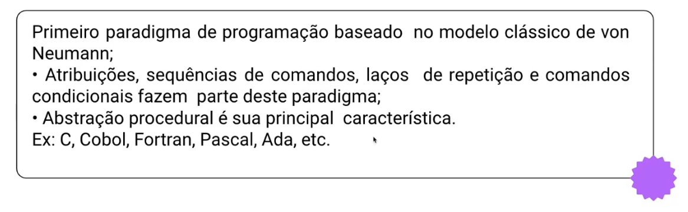

### Paradigma Imperativo Orientação a objetos

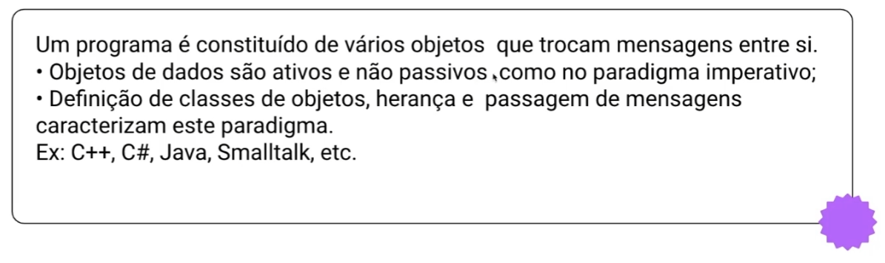

### Paradigma Declarativo Funcional

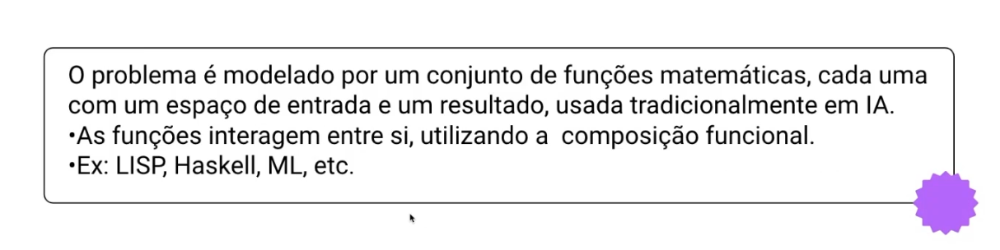

### Paradigma Declarativo Lógico

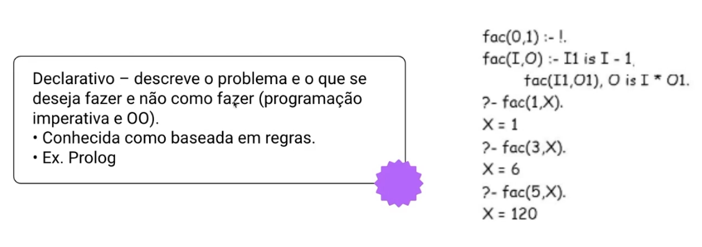

## Estrutura de Tipos

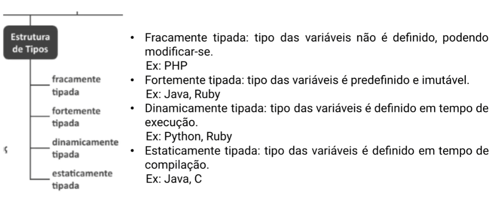

## Grau de abstração

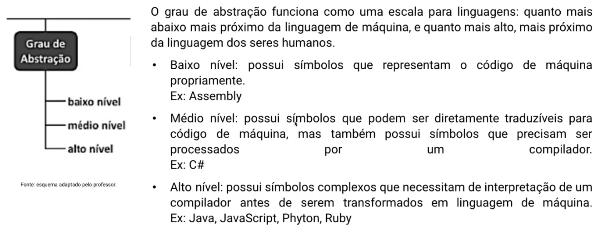

Entrada → Processamentos → saídas

## Comparações

Estrutura de controle nas linguagens C, C++, C# e Java são identicas! 

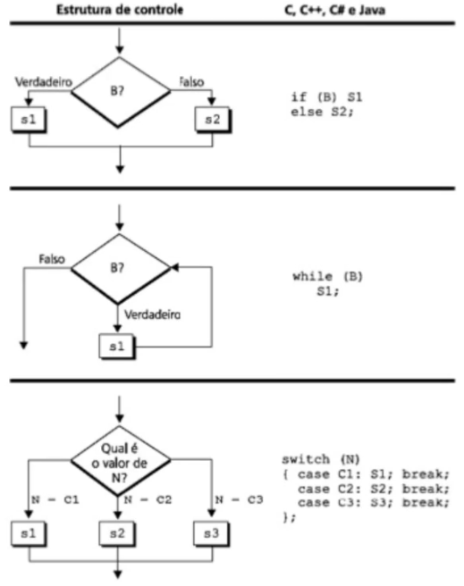

## Declaração de variáveis

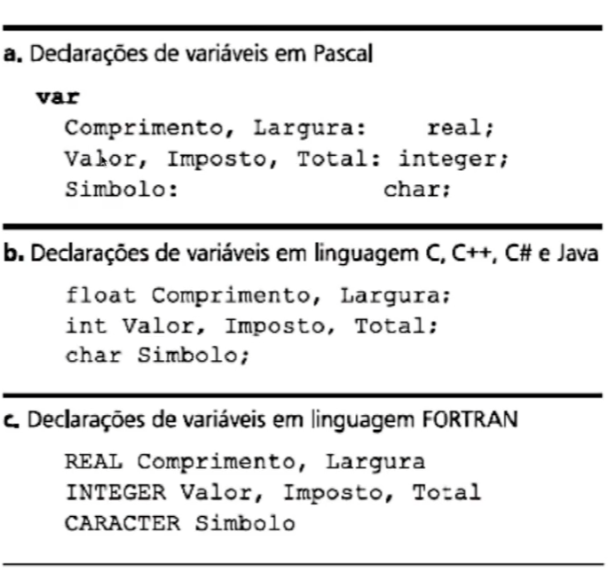
