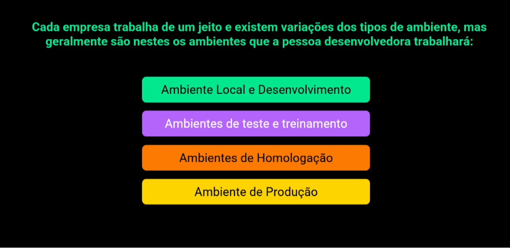

 
 # Ambientes de desenvolvimento

## Ambiente local e desenvolvimento

**Ambiente local:** Ambiente do próprio desenvolvedor em sua máquina.
**Ambiente de desenvolvimento:** ambiente específico para desenvolvedores, um pouco instável semelhante ao ambiente de produção, pode ser alterado sem revisão prévia.

## Ambiente de teste e treinamento

Conhecido como ambiente de QA (Analistas de qualidade), existe times que tem uma pessoa específica para isso, porém a pessoa desenvolvedora também pode desempenhar este papel.

Ambiente estável com massas de teste específico voltado para a demanda de trabalho, ambiente que não pode ser alterado a qualquer hora, é estritamente necessário informar que está subindo uma nova funcionalidade para não alterar testes de outras funcionalidades que estão testando junto.

**Ambiente de treinamento:** 
É um local intermediário de aprendizado para novos desenvolvedores que não altera nenhum dos ambientes que atuam diretamente no sistema.
Serve para controlar o treinamento de novos desenvolvedores que estarão entrando no time de desenvolvimento.

## Ambiente de homologação:

Ambiente de teste assistido para o que cliente validade a solução que foi solicitado.

**Ambiente de pré-produção:** Usa-se dados mascarados, os dados valiosos do sistema não devem estar contidos nos ambientes mais baixos, (Desenvolvimento, Teste e Homologação), deve seguir de acordo com as leis de segurança de dados.

## Ambiente de produção

Ambiente público, ambinte final já rodando pronto para o cliente utilizar.

## Ciclo do desenvolvimento

Código local → Ambiente de desenvolvimento → ambiente de QA(teste) → homologação → produção

## Prioridades

ambiente de produção
Ambiente de homologação
Ambiente de teste e treinamento
Ambiente de desenvolvimento