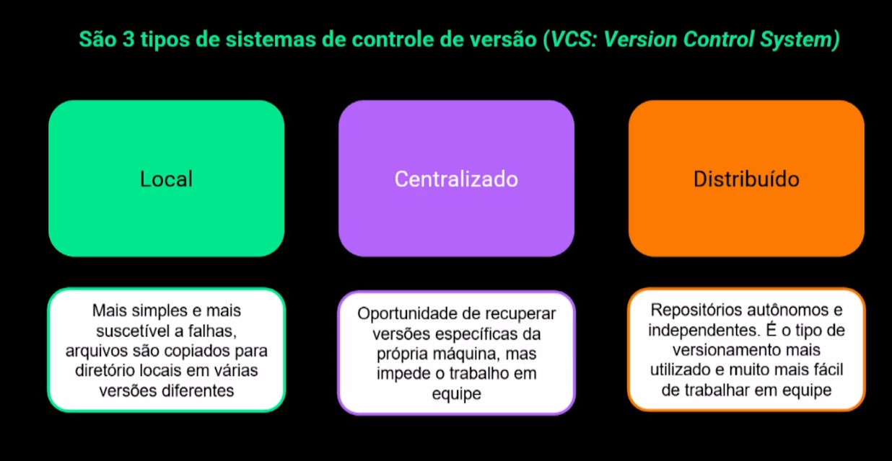

# Versionamento de código

Estratégia para trabalhar em conjunto e gerenciar diferentes versões de um código.
Administrar mudanças realizadas, garantir segurança em transição de versões e trabalhar em equipe de forma mais rápida.

## Controle de versão VCS: *Version Control System*

