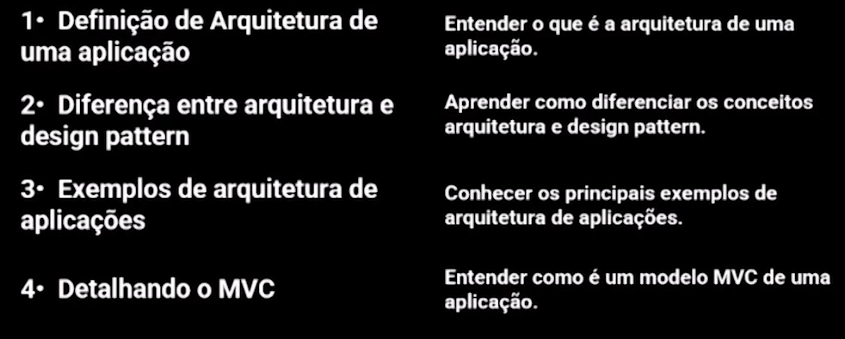
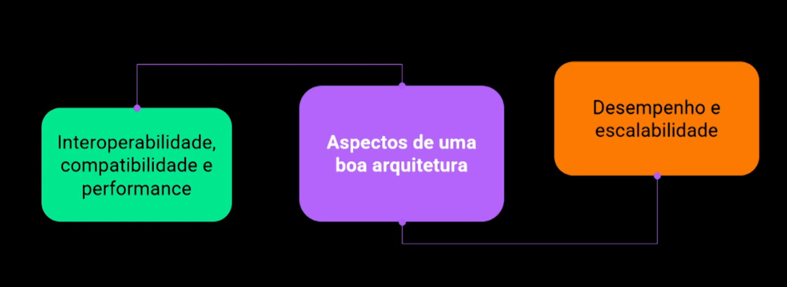
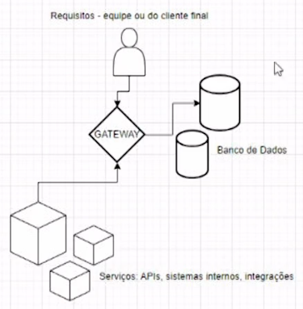
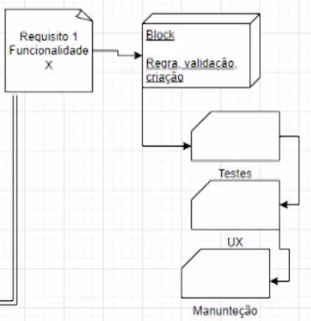
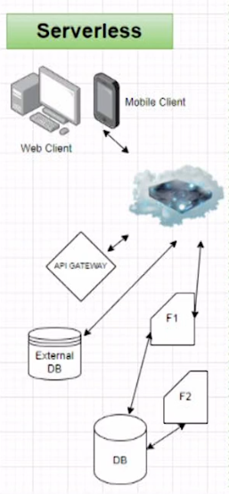
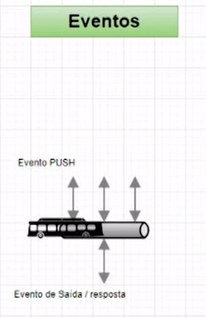
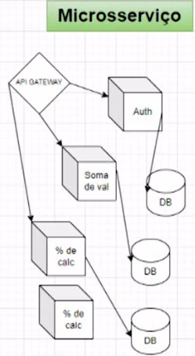
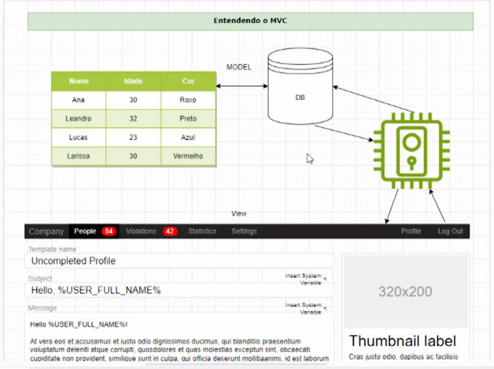

 # MVC

### Sumário

 
 ## 1- Arquitetura de aplicação:
  
É um roadmap e práticas recomendadas a serem seguidas durante o desenvolvimento para ter uma aplicação bem estruturada e de facil manutenabilidade.

**Interoperabilidade:** Capacidade do sistema de se comunicar entre sistemas

## 2- Diferença entre arquitetura e Design pattern

O design pattern é responsável pela estrutura no nível de código, como cada módulo executa uma função, o escopo das classes e também os objetivos das funções.

**Arquitetura**
- Requisitos
- infraestrutura
- Definições

**Design Pattern**
- Trecho do código específico
- Comportamento da aplicação
- Independente do resto

## 3- Exemplos de Arquitetura de aplicações

**Arquitetura Serverless:**
refere-se à solução de aplicativo que depende de serviços de terceiros para gerenciar a complexidade dos servidores e o gerenciamento do backend.

**Arquitetura orientada a eventos:**
tem como base principal o desacoplamento
das partes do sistema e como cada parte será acionada quando um evento interessante de outra parte for acionado.

**Arquitetura de microsserviços:** é um uso muito popular nos últimos anos, ele depende de serviços modulares pequenos e independentes, em que cada serviço
resolve um problema específico ou executa uma tarefa exclusiva, eles se comunicam através de uma API bem definida

## 4- Detalhando o MVC

MVC é um padrão de design utilizado para desacoplar a interface de usuário, dados e a lógica do aplicativo, a sigla significa **Model, View, Controller.**

