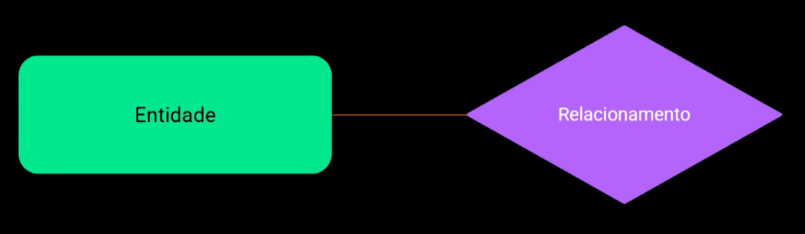

# Adic. CRUD no projeto

**Resumo**

## 1- Revisão entidade → Relacionamento

## 2- Mapeamento de Rotas dos Controladores

Adicionando os controllers no route.js e modulando os controllers com o express( explicação em projeto NoSQL nas minhas anotações. )

## 3- Criação dos modelos com Entidade-Relacionamento
O relacionamento em um banco NoSQL é frequentemente implementado na lógica da aplicação. Isso ocorre porque uma ação pode depender de um dado presente em outro documento, e você precisará validar se o dado solicitado está disponível nesse documento específico.

## 4- Criação das Ações de CRUD

**Relembreando**

CRUD é um acrônimo que representa as quatro operações básicas em um banco de dados:

- **Create (Criar):** Inserir novos dados no banco.
- **Read (Ler):** Consultar e visualizar os dados existentes.
- **Update (Atualizar):** Modificar dados existentes.
- **Delete (Excluir):** Remover dados do banco.

Essas operações são essenciais para a manipulação de dados em qualquer sistema de gerenciamento de banco de dados.